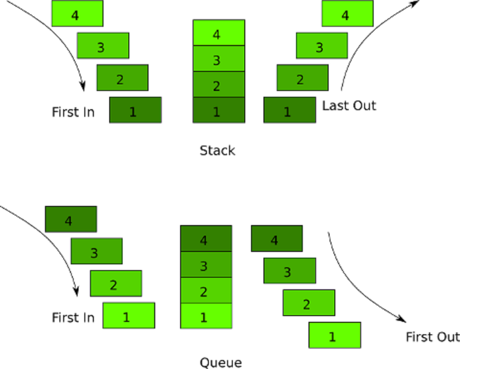

# DSA Workshop (Stack and Queue)

## Stack

Stack is a **LIFO** (last in first out) data structure.

### Real life stacks

- A stack of dishes
- A pile of t-shirts

### Some practical use-cases of a stack:

- Reversing order
- "Undo" functionality
- Several important algorithms (like DFS)
- The call stack - keeping track of currently active methods

### Common operations on a stack

- `push(element)` - add an element to the stack
- `pop()` - remove an element from the top of the stack
- `peek()` - get the value of the first element, without removing it

## Queue

Queue is a **FIFO** (first in first out) data structure.

### Some practical use-cases of a queue:

- Breadth-First Search in a tree/graph
- In a call center - to manage the people who need to be helped
- Printing documents - the printer can only print one at a time, the others are next in line (First in, first out)

### Common operations on a queue

- `enqueue(element)` - adding an element to the queue
- `dequeue()`  - removing an element from the queue
- `peek()` - get the value of the first element, without removing it

## Stack vs Queue

## Task

Your task is to implement a stack and a queue, using the skeleton provided. There are unit tests provided which cover the functionality of both Stack and Queue. There's a `LinkedListNode` class provided in the skeleton. You are **not allowed to modify it**.

### Guidelines:

#### Stack

Finish the Stack class by providing the following functionality:

- `push()` - adds an element to the top of the stack
- `pop()` - removes the element from the top of the stack
- `peek()` - returns the value of the top element without removing it
- `count` - returns the number of elements in the stack
- `is_empty` - returns a boolean indicating whether the stack is empty

Note that some of the required implementations are methods and others are properties. Do not change the names, because the unit tests depend on them.

#### Queue

Finish the Queue class by providing the following functionality:

- `enqueue()` - adds an element to the end of the queue
- `dequeue()` - removes the element from the front of the queue
- `peek()` - returns the value of the front element without removing it
- `count` - returns the number of elements in the queue
- `is_empty` - returns a bool indicating whether the queue is empty

Note that some of the required implementations are methods and others are properties. Do not change the names, because the unit tests depend on them.